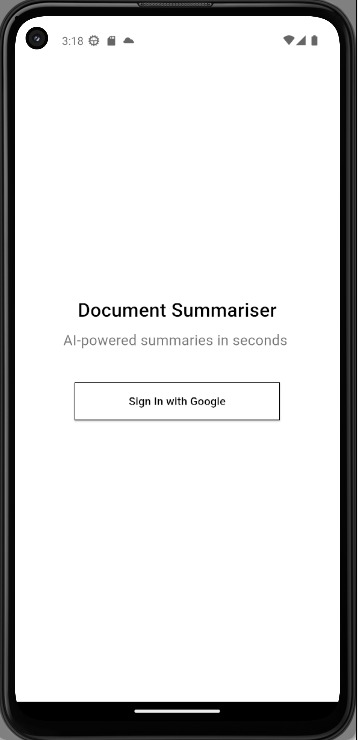
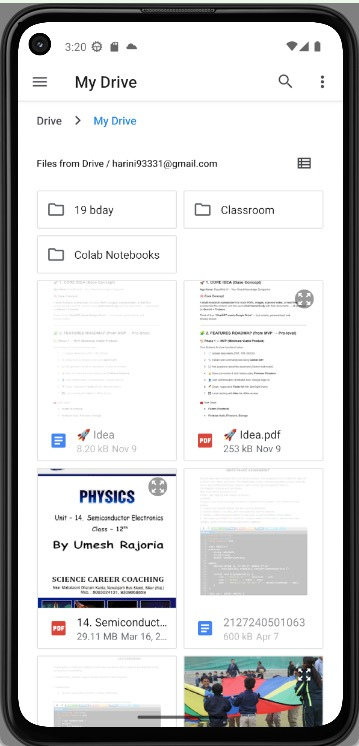
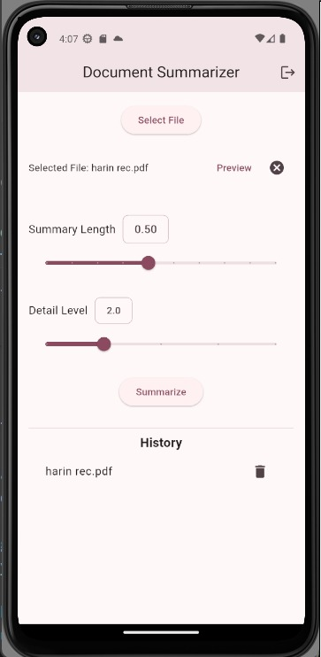
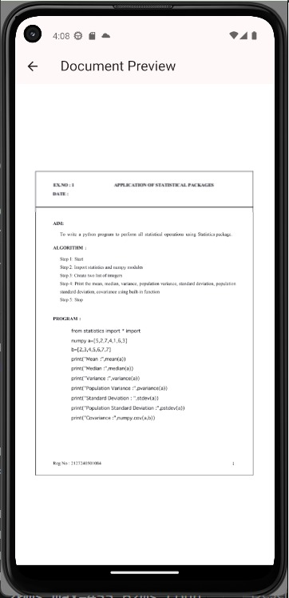
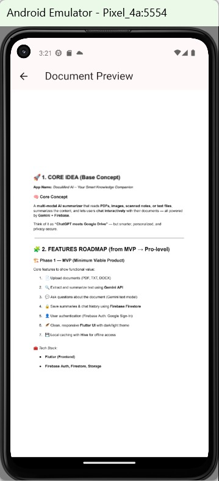
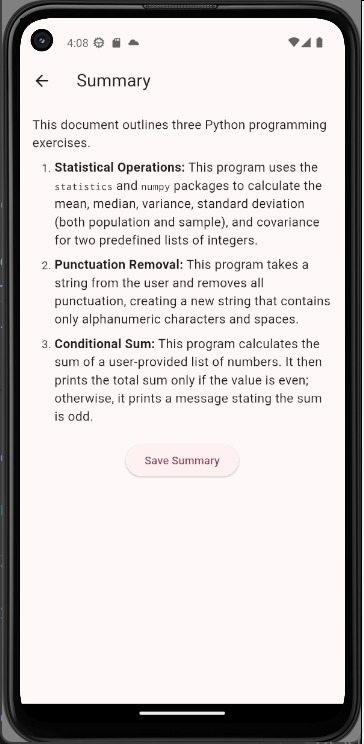
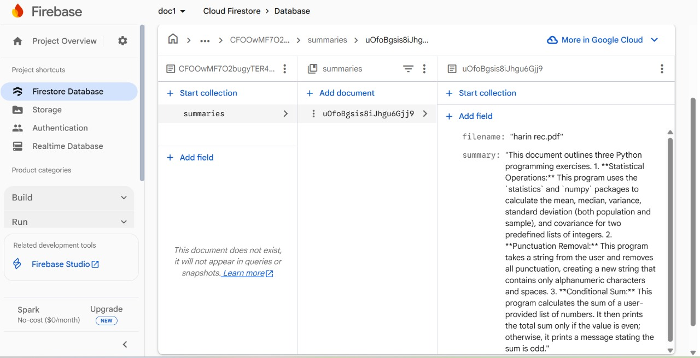

# App Screenshots

This file shows the main screens of the Document Summarizer App.  

---

## 1. Login Screen
Users can sign in securely using Google authentication.  

---

## 2. Document Picker
Users can select PDF, DOCX, or TXT files to summarize.  

---

Users need to specify their requirements.

---
## 3. Document Preview
Preview the selected document before generating a summary.  

---

## 4. Summary Output
The AI-generated summary is displayed here, with customizable length options.  

---

## 5. Summary History
View, revisit, or delete previously generated summaries stored in Firestore.  

---

This screenshot shows the integration of local storage using **Firebase**

---
